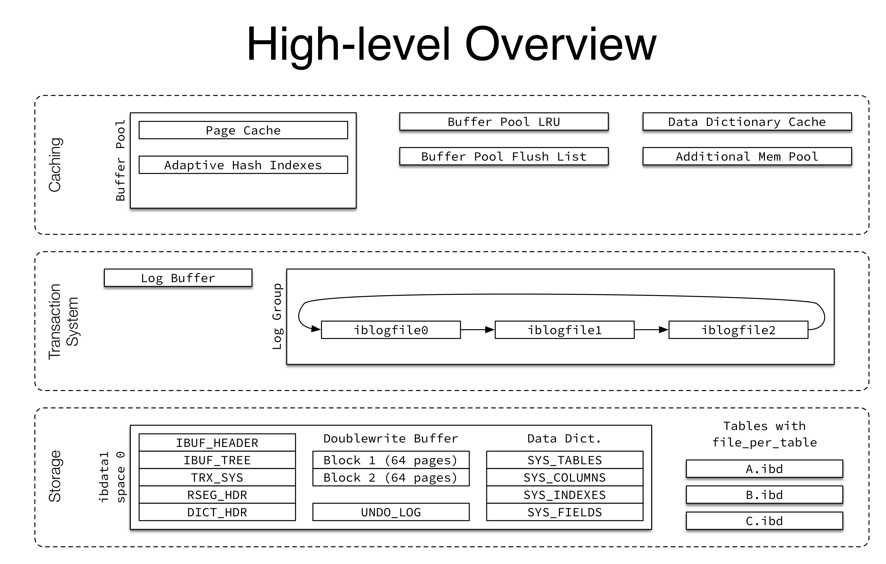
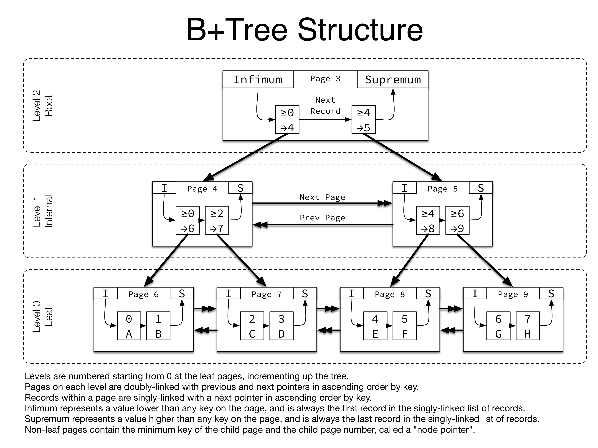

- # mysql 单表性能 

## mysql 源码调试
[vscode 调试mysql源码](https://github.com/ymm135/golang-cookbook/blob/master/md/middleware/mysql/mysql-debug-source.md)  
## mysql 结构
[innodb 整体架构](https://github.com/ymm135/golang-cookbook/blob/master/md/middleware/mysql/mysql-base.md#innodb)

## 性能数据
测试工具为`sysbench` [详情](../README.md#sysbench性能监测)  
```shell
# 本地测试
HOST=localhost
LUA_FILE=/usr/share/sysbench/tests/include/oltp_legacy/oltp.lua
SIZE=10000000

sysbench $LUA_FILE \
 --mysql-host=$HOST \
 --mysql-port=3306 \
 --mysql-socket=/tmp/mysql.sock \
 --mysql-user=root --mysql-password=root \
 --oltp-test-mode=complex --oltp-tables-count=10 \
 --oltp-table-size=$SIZE --threads=10 --time=120 \
 --report-interval=10 \
 prepare
 # 运行
 run >> mysysbench.log
 # 清理
 cleanup
```
### 10w  

```shell
Threads started!

[ 10s ] thds: 10 tps: 795.62 qps: 15922.34 (r/w/o: 11147.01/3183.09/1592.24) lat (ms,95%): 55.82 err/s: 0.00 reconn/s: 0.00
[ 20s ] thds: 10 tps: 966.38 qps: 19335.32 (r/w/o: 13534.96/3867.60/1932.75) lat (ms,95%): 44.17 err/s: 0.00 reconn/s: 0.00
[ 30s ] thds: 10 tps: 1016.04 qps: 20321.42 (r/w/o: 14224.58/4064.76/2032.08) lat (ms,95%): 41.85 err/s: 0.00 reconn/s: 0.00
[ 40s ] thds: 10 tps: 938.32 qps: 18764.03 (r/w/o: 13135.53/3751.86/1876.63) lat (ms,95%): 41.85 err/s: 0.00 reconn/s: 0.00
[ 50s ] thds: 10 tps: 909.27 qps: 18182.29 (r/w/o: 12728.44/3635.30/1818.55) lat (ms,95%): 47.47 err/s: 0.00 reconn/s: 0.00
[ 60s ] thds: 10 tps: 945.80 qps: 18916.88 (r/w/o: 13241.75/3783.52/1891.61) lat (ms,95%): 45.79 err/s: 0.00 reconn/s: 0.00
[ 70s ] thds: 10 tps: 974.55 qps: 19495.29 (r/w/o: 13645.49/3900.70/1949.10) lat (ms,95%): 44.17 err/s: 0.00 reconn/s: 0.00
[ 80s ] thds: 10 tps: 979.94 qps: 19593.09 (r/w/o: 13716.33/3916.88/1959.89) lat (ms,95%): 44.17 err/s: 0.00 reconn/s: 0.00
[ 90s ] thds: 10 tps: 930.37 qps: 18613.17 (r/w/o: 13027.33/3725.09/1860.75) lat (ms,95%): 44.17 err/s: 0.00 reconn/s: 0.00
[ 100s ] thds: 10 tps: 904.62 qps: 18087.19 (r/w/o: 12662.75/3615.20/1809.25) lat (ms,95%): 43.39 err/s: 0.00 reconn/s: 0.00
[ 110s ] thds: 10 tps: 977.44 qps: 19554.81 (r/w/o: 13686.90/3913.04/1954.87) lat (ms,95%): 44.98 err/s: 0.00 reconn/s: 0.00
[ 120s ] thds: 10 tps: 1020.66 qps: 20407.27 (r/w/o: 14286.29/4079.65/2041.33) lat (ms,95%): 41.85 err/s: 0.00 reconn/s: 0.00
SQL statistics:
    queries performed:
        read:                            1590470
        write:                           454420
        other:                           227210
        total:                           2272100
    transactions:                        113605 (946.22 per sec.)
    queries:                             2272100 (18924.41 per sec.)
    ignored errors:                      0      (0.00 per sec.)
    reconnects:                          0      (0.00 per sec.)

General statistics:
    total time:                          120.0570s
    total number of events:              113605

Latency (ms):
         min:                                    1.96
         avg:                                   10.56
         max:                                  335.25
         95th percentile:                       44.17
         sum:                              1200098.51

Threads fairness:
    events (avg/stddev):           11360.5000/21.67
    execution time (avg/stddev):   120.0099/0.02
```

### 100w
```shell
SQL statistics:
    queries performed:
        read:                            321552
        write:                           91872
        other:                           45936
        total:                           459360
    transactions:                        22968  (191.32 per sec.)
    queries:                             459360 (3826.37 per sec.)
    ignored errors:                      0      (0.00 per sec.)
    reconnects:                          0      (0.00 per sec.)

General statistics:
    total time:                          120.0462s
    total number of events:              22968

Latency (ms):
         min:                                    2.71
         avg:                                   52.26
         max:                                  382.62
         95th percentile:                      134.90
         sum:                              1200279.45

Threads fairness:
    events (avg/stddev):           2296.8000/11.69
    execution time (avg/stddev):   120.0279/0.00
```

### 1000w

```shell
SQL statistics:
    queries performed:
        read:                            134162
        write:                           38332
        other:                           19166
        total:                           191660
    transactions:                        9583   (79.79 per sec.)
    queries:                             191660 (1595.78 per sec.)
    ignored errors:                      0      (0.00 per sec.)
    reconnects:                          0      (0.00 per sec.)

General statistics:
    total time:                          120.0997s
    total number of events:              9583

Latency (ms):
         min:                                    3.95
         avg:                                  125.31
         max:                                 3273.44
         95th percentile:                      303.33
         sum:                              1200799.42

Threads fairness:
    events (avg/stddev):           958.3000/10.29
    execution time (avg/stddev):   120.0799/0.02
```


### 10000w
```shell
mysql> select count(*) from sbtest1;
+-----------+
| count(*)  |
+-----------+
| 100000000 |
+-----------+
1 row in set (14.72 sec)

# count cpu占用
2012 mysql     20   0 3968776 405244   5564 S  56.5  2.5 141:19.38 mysqld
```

性能数据位置，数据准备5个小时，最后只有三张表有1亿，脚本退出了。  

### 汇总
| 数据量 | 最小值(ms) | 平均值(ms) | 最大值(ms) | 
| ----- | ------- | ------- | ----- |
| 10w | 1.96 | 10.56 | 335.25 | 
| 100w |  2.71 | 52.26 | 382.62 | 
| 1000w |  3.95 | 125.31 | 3273.44 | 


## 原理分析
### Mysql InnoDB 表文件结构

[mysql表文件结构](https://blog.jcole.us/2013/01/04/page-management-in-innodb-space-files/)  

创建数据库`sbtest`,创建十张表格`sbtest1~10`,1千万条数据,mysql数据结构
`/data/mysql/data/sbtest`  
```shell
-rw-r----- 1 mysql mysql   1M 10月 10 14:38 db.opt
-rw-r----- 1 mysql mysql   1M 10月 10 17:42 sbtest10.frm
-rw-r----- 1 mysql mysql 240M 10月 10 17:42 sbtest10.ibd
-rw-r----- 1 mysql mysql   1M 10月 10 17:20 sbtest1.frm
-rw-r----- 1 mysql mysql 240M 10月 10 17:21 sbtest1.ibd
```

查看表结构
```shell
mysql> desc sbtest1;
+-------+------------------+------+-----+---------+----------------+
| Field | Type             | Null | Key | Default | Extra          |
+-------+------------------+------+-----+---------+----------------+
| id    | int(10) unsigned | NO   | PRI | NULL    | auto_increment |
| k     | int(10) unsigned | NO   | MUL | 0       |                |
| c     | char(120)        | NO   |     |         |                |
| pad   | char(60)         | NO   |     |         |                |
+-------+------------------+------+-----+---------+----------------+
4 rows in set (0.03 sec)
```

1百万数据应有大小:  
`1000000 * 200Byte` = `190.73M`  


存储引擎是InnoDB, 在data目录下会看到2类文件：.frm、.ibd  
（1）*.frm--表结构的文件。  

（2）*.ibd--表数据和索引的文件。该表的索引(B+树)的每个非叶子节点存储索引，叶子节点存储索引和索引对应的数据。  

`db.opt`包含`sbtest`数据库的信息  
```shell
$ hexdump -v -C db.opt 
00000000  64 65 66 61 75 6c 74 2d  63 68 61 72 61 63 74 65  |default-characte|
00000010  72 2d 73 65 74 3d 75 74  66 38 0a 64 65 66 61 75  |r-set=utf8.defau|
00000020  6c 74 2d 63 6f 6c 6c 61  74 69 6f 6e 3d 75 74 66  |lt-collation=utf|
00000030  38 5f 67 65 6e 65 72 61  6c 5f 63 69 0a           |8_general_ci.|
0000003d
```

查看`.frm`内容 [官方解释](https://dev.mysql.com/doc/internals/en/frm-file-format.html)  
```shell
$ hexdump -v -C sbtest1.frm
00000000  fe 01 09 0c 03 00 00 10  01 00 00 30 00 00 c2 02  |...........0....|
00000010  25 02 40 42 0f 00 00 00  00 00 00 02 36 00 08 00  |%.@B........6...|
00000020  00 05 00 00 00 00 21 00  00 00 00 00 00 00 00 c2  |......!.........|
00000030  02 00 00 31 c6 00 00 21  00 00 00 00 00 00 00 00  |...1...!........|
00000040  2f 2f 00 00 20 00 00 00  00 00 00 00 00 00 00 00  |//.. ...........|
00000050  00 00 00 00 00 00 00 00  00 00 00 00 00 00 00 00  |................|

$ hexdump -v -C -s 0x2100 sbtest1.frm
00002100  01 00 04 00 47 00 31 02  00 00 25 02 0d 00 00 00  |....G.1...%.....|
00002110  00 00 00 00 00 00 50 00  16 00 00 00 00 00 00 00  |......P.........|
00002120  47 00 05 04 02 14 29 20  20 20 20 20 20 20 20 20  |G.....)         |
00002130  20 20 20 20 20 20 20 20  20 20 20 20 20 20 20 20  |                |
00002140  20 20 20 20 20 20 20 20  20 20 20 20 20 20 20 00  |               .|
00002150  04 00 03 69 64 00 05 00  02 6b 00 06 00 02 63 00  |...id....k....c.|
00002160  07 00 04 70 61 64 00 04  03 0b 0b 00 02 00 00 1b  |...pad..........|
00002170  00 0f 00 00 03 21 00 00  05 02 0a 0a 00 06 00 00  |.....!..........|
00002180  1a 00 00 00 00 03 21 00  00 06 02 4d 68 01 0a 00  |......!....Mh...|
00002190  00 00 00 00 00 00 fe 21  00 00 07 04 4b b4 00 72  |.......!....K..r|
000021a0  01 00 00 00 00 00 00 fe  21 00 00 ff 69 64 ff 6b  |........!...id.k|
000021b0  ff 63 ff 70 61 64 ff 00                           |.c.pad..|
000021b8
```

查看`sbtest1`信息  
```shell
mysql> select * from sbtest1 limit 2;
+----+--------+-------------------------------------------------------------------------------------------------------------------------+-------------------------------------------------------------+
| id | k      | c                                                                                                                       | pad                                                         |
+----+--------+-------------------------------------------------------------------------------------------------------------------------+-------------------------------------------------------------+
|  1 | 499284 | 83868641912-28773972837-60736120486-75162659906-27563526494-20381887404-41576422241-93426793964-56405065102-33518432330 | 67847967377-48000963322-62604785301-91415491898-96926520291 |
|  2 | 501969 | 38014276128-25250245652-62722561801-27818678124-24890218270-18312424692-92565570600-36243745486-21199862476-38576014630 | 23183251411-36241541236-31706421314-92007079971-60663066966 |
+----+--------+-------------------------------------------------------------------------------------------------------------------------+-------------------------------------------------------------+
```

在`ibd`文件中查询到该记录，并且同一条记录是线性存储的。  
```shell
[root@d1 sbtest]# hexdump -v -C -s 0x00010060 -n 300 sbtest1.ibd
00010060  02 00 1c 69 6e 66 69 6d  75 6d 00 01 00 0b 00 00  |...infimum......|
00010070  73 75 70 72 65 6d 75 6d  3c 78 00 00 10 00 d0 00  |supremum<x......|
00010080  00 00 01 00 00 00 00 19  f6 ab 00 00 01 5e 01 10  |.............^..|
00010090  00 07 9e 54 38 33 38 36  38 36 34 31 39 31 32 2d  |...T83868641912-|
000100a0  32 38 37 37 33 39 37 32  38 33 37 2d 36 30 37 33  |28773972837-6073|
000100b0  36 31 32 30 34 38 36 2d  37 35 31 36 32 36 35 39  |6120486-75162659|
000100c0  39 30 36 2d 32 37 35 36  33 35 32 36 34 39 34 2d  |906-27563526494-|
000100d0  32 30 33 38 31 38 38 37  34 30 34 2d 34 31 35 37  |20381887404-4157|
000100e0  36 34 32 32 32 34 31 2d  39 33 34 32 36 37 39 33  |6422241-93426793|
000100f0  39 36 34 2d 35 36 34 30  35 30 36 35 31 30 32 2d  |964-56405065102-|
00010100  33 33 35 31 38 34 33 32  33 33 30 20 36 37 38 34  |33518432330 6784|
00010110  37 39 36 37 33 37 37 2d  34 38 30 30 30 39 36 33  |7967377-48000963|
00010120  33 32 32 2d 36 32 36 30  34 37 38 35 33 30 31 2d  |322-62604785301-|
00010130  39 31 34 31 35 34 39 31  38 39 38 2d 39 36 39 32  |91415491898-9692|
00010140  36 35 32 30 32 39 31 20  3c 78 00 00 18 00 d0 00  |6520291 <x......|
00010150  00 00 02 00 00 00 00 19  f6 ab 00 00 01 5e 01 1c  |.............^..|
00010160  00 07 a8 d1 33 38 30 31  34 32 37 36 31 32 38 2d  |....38014276128-|
00010170  32 35 32 35 30 32 34 35  36 35 32 2d 36 32 37 32  |25250245652-6272|
00010180  32 35 36 31 38 30 31 2d  32 37 38 31              |2561801-2781|
```

### innodb_ruby 工具
innodb_ruby是一款用ruby写的用来分析 innodb 物理文件的专业DBA工具，可以通过这款工具来窥探innodb内部的一些结构。

测试数据,仅保留1w数据  
```sql
delete from sbtest1 where id > 10000 ;
```

原始文件大小
```shell
-rw-r----- 1 mysql mysql   1M 10月 25 22:33 sbtest1.frm
-rw-r----- 1 mysql mysql  10M 10月 25 22:33 sbtest1.ibd
```

表结构修改
```
DROP TABLE IF EXISTS `sbtest1`;
CREATE TABLE `sbtest1` (
  `id` int unsigned NOT NULL AUTO_INCREMENT, int(10)    =>   `id` int NOT NULL AUTO_INCREMENT,  int(11)
  `k` int(10) unsigned NOT NULL DEFAULT '0',
  `c` char(120) NOT NULL DEFAULT '',
  `pad` char(60) NOT NULL DEFAULT '',
  PRIMARY KEY (`id`)
) ENGINE=InnoDB AUTO_INCREMENT=1000001 DEFAULT CHARSET=utf8 MAX_ROWS=1000000;
```

> `id` int unsigned NOT NULL AUTO_INCREMENT, int(10)    =>   `id` int NOT NULL AUTO_INCREMENT,  int(11)

读取每行记录的ruby文件`simple_t_describer.rb`  
```ruby
# frozen_string_literal: true

class SimpleDescriber < Innodb::RecordDescriber
  type :clustered
  key "id", :INT, :NOT_NULL
  row "s", "VARCHAR(100)", :NOT_NULL
end
```

ubuntu
```
sudo apt install ruby
sudo apt-get install ruby-dev
sudo gem install innodb_ruby

# 需要安装的库
sudo apt install gnuplot
sudo gem install gnuplot
```

查看page类型
```shell
$ innodb_space -f sbtest1.ibd space-page-type-summary
type                count       percent     description         
ALLOCATED           481         75.16       Freshly allocated   
INDEX               156         24.38       B+Tree index        
FSP_HDR             1           0.16        File space header   
IBUF_BITMAP         1           0.16        Insert buffer bitmap
INODE               1           0.16        File segment inode  
```

```
$ innodb_space -f sbtest1.ibd space-index-pages-summary
page        index   level   data    free    records 
3           99      1       1794    14392   138     
4           99      0       7488    8746    36      
5           99      0       15184   1034    73      
6           99      0       15184   1034    73      
7           99      0       15184   1034    73      
8           99      0       15184   1034    73      
9           99      0       15184   1034    73      
10          99      0       15184   1034    73      
11          99      0       15184   1034    73      
12          99      0       15184   1034    73      
13          99      0       15184   1034    73      
14          99      0       15184   1034    73      
...
632         0       0       0       16384   0       
633         0       0       0       16384   0       
634         0       0       0       16384   0       
635         0       0       0       16384   0       
636         0       0       0       16384   0       
637         0       0       0       16384   0       
638         0       0       0       16384   0       
639         0       0       0       16384   0 
```

读取page3的索引
```shell
$ innodb_space -f sbtest1.ibd -r simple_t_describer.rb -d SimpleDescriber -p 3 index-recurse
ROOT NODE #3: 138 records, 1794 bytes
  NODE POINTER RECORD ≥ (id=1) → #4
  LEAF NODE #4: 36 records, 7488 bytes
    RECORD: (id=1) → (s="\x00\a\x9ET83868641912-28773972837-60736120486-75162659906-27563526494-20381887404-41576422241-93426793964-56405065102-33518432")
    RECORD: (id=2) → (s="\x00\a\xA8\xD138014276128-25250245652-62722561801-27818678124-24890218270-18312424692-92565570600-36243745486-21199862476-38576014")
    RECORD: (id=3) → (s="\x00\a\xB1\xC533973744704-80540844748-72700647445-87330233173-87249600839-07301471459-22846777364-58808996678-64607045326-48799346")
    RECORD: (id=4) → (s="\x00\a\xA8\xFE37002370280-58842166667-00026392672-77506866252-09658311935-56926959306-83464667271-94685475868-28264244556-14550208")
NODE POINTER RECORD ≥ (id=37) → #5
  LEAF NODE #5: 73 records, 15184 bytes
    RECORD: (id=37) → (s="\x00\a\x8F\xF531390791732-14474603275-40947644419-95083465698-00394007164-71252065011-51933878081-74736597965-56683186721-13190868")
    RECORD: (id=38) → (s="\x00\b\xCEo27387653127-48482804124-85747486554-39115791413-47418345043-64964838715-56347608621-08186219662-72659783491-04801425")
    RECORD: (id=39) → (s="\x00\t\x0ET24675450761-54975421618-19247815441-69692377864-52758432916-33530360540-58005979637-39454948141-52245350093-94859169")
NODE POINTER RECORD ≥ (id=110) → #6
  LEAF NODE #6: 73 records, 15184 bytes
    RECORD: (id=110) → (s="\x00\a\xA9P78956063981-24807505130-36116934140-67849788469-74602569410-19719956076-17177520794-67076044169-05696381663-01492329")
    RECORD: (id=111) → (s="\x00\a\xB4\x8A67843854726-73061607283-77967507503-75682264949-54173001232-59774452688-33069071204-69280020454-82305612538-24500171")
    RECORD: (id=112) → (s="\x00\a\xB4`49354424071-73166302830-28695446392-53185391107-31229732668-04518080233-98754980453-69993594754-19297005308-93147186")
    RECORD: (id=113) → (s="\x00\a\x9B\xF404764945864-58851778540-16179490886-93896634127-58221447925-63834493988-87210065363-43637577900-43678609593-59407762")
NODE POINTER RECORD ≥ (id=9965) → #169
  LEAF NODE #169: 36 records, 7488 bytes
    RECORD: (id=9965) → (s="\x00\a\xB1c63843258460-53164086659-85740499495-14780270401-47145537461-36743220726-47272209477-70191308173-15134963403-20913877")
    RECORD: (id=9966) → (s="\x00\a\xAA\xA040734820963-57489085980-50902451136-51404878634-58002623476-53090638152-17534762296-60779340746-48004531934-26939282")
    ...
    RECORD: (id=9999) → (s="\x00\a\xA8\xF662701858327-35866851234-93729669186-57887394442-90590186058-75032438032-65535090240-47094973604-86168857105-45594113")
    RECORD: (id=10000) → (s="\x00\a\x97\xE632313506896-45487196249-45997780992-14253108445-20958315096-93117582340-47481141429-83305213014-08086237975-93876649")
```

查看页面记录
```shell
$ innodb_space -f sbtest1.ibd -r simple_t_describer.rb -d SimpleDescriber -p 3  page-records
Record 125: (id=1) → #4
Record 138: (id=37) → #5
Record 151: (id=110) → #6
Record 164: (id=183) → #7
Record 177: (id=256) → #8
Record 190: (id=329) → #9
Record 203: (id=402) → #10
Record 216: (id=475) → #11
Record 229: (id=548) → #12
...
Record 1867: (id=9746) → #166
Record 1880: (id=9819) → #167
Record 1893: (id=9892) → #168
Record 1906: (id=9965) → #169

$ innodb_space -f sbtest1.ibd -r simple_t_describer.rb -d SimpleDescriber -p 4  page-records
Record 127: (id=1) → (s="\x00\a\x9ET83868641912-28773972837-60736120486-75162659906-27563526494-20381887404-41576422241-93426793964-56405065102-33518432")
Record 335: (id=2) → (s="\x00\a\xA8\xD138014276128-25250245652-62722561801-27818678124-24890218270-18312424692-92565570600-36243745486-21199862476-38576014")
Record 543: (id=3) → (s="\x00\a\xB1\xC533973744704-80540844748-72700647445-87330233173-87249600839-07301471459-22846777364-58808996678-64607045326-48799346")
Record 751: (id=4) → (s="\x00\a\xA8\xFE37002370280-58842166667-00026392672-77506866252-09658311935-56926959306-83464667271-94685475868-28264244556-14550208")
Record 959: (id=5) → (s="\x00\a\xA0e44257470806-17967007152-32809666989-26174672567-29883439075-95767161284-94957565003-35708767253-53935174705-16168070")

$ innodb_space -f sbtest1.ibd -r simple_t_describer.rb -d SimpleDescriber -p 5  page-records
Record 127: (id=37) → (s="\x00\a\x8F\xF531390791732-14474603275-40947644419-95083465698-00394007164-71252065011-51933878081-74736597965-56683186721-13190868")
Record 335: (id=38) → (s="\x00\b\xCEo27387653127-48482804124-85747486554-39115791413-47418345043-64964838715-56347608621-08186219662-72659783491-04801425")
Record 543: (id=39) → (s="\x00\t\x0ET24675450761-54975421618-19247815441-69692377864-52758432916-33530360540-58005979637-39454948141-52245350093-94859169")
Record 751: (id=40) → (s="\x00\a\xAFi96458712584-04274358647-34600172982-61258877004-02456216612-93017353068-68948947187-65320412979-86812414667-04055433")
Record 959: (id=41) → (s="\x00\a\x9DY56108466722-78493827923-73171405107-31449034460-74143529906-15657516993-20446302671-00649349958-00486571786-06593628")

```

<div align=center>
</img>
</div>

mysql innodb b+树索引

<div align=center>
</img>
</div>

Levels are numbered starting from O at the leaf pages, incrementing up the tree.  
Pages on each level are doubly-linked with previous and next pointers in ascending order by key.  
Records within a page are singly-linked with a next pointer in ascending order by key.  
Infimum represents a value lower than any key on the page, and is always the first record in the singly-linked list of records.  
Supremum represents a value higher than any key on the page, and is always the last record in the singly-linked list of records.  
Non-leaf pages contain the minimum key of the child page and the child page number, called a "node pointer"    

级别从叶页的 O 开始编号，向上递增。  
每一层的页面都与前一个和下一个指针通过键以升序进行双重链接。  
页面内的记录通过键按升序与下一个指针单独链接。  
Infimum 表示一个低于页面上任何键的值，并且始终是单链记录列表中的第一条记录。  
Supremum 表示高于页面上任何键的值，并且始终是单链记录列表中的最后一条记录。  
非叶子页面包含子页面的最小键和子页码，称为“节点指针”  


<div align=center>
</img>
</div>

### mysql 查询流程

开启mysql日志模式`--debug=d,info,error,query,general,where:O,/tmp/mysqld.trace`  

Processing a query goes through 5 phases (parsing is already done)
 - Preparation
 - Locking of tables
 - Optimization
 - Execution or explain
 - Cleanup


```shell
# 在page5中
mysql> select * from sbtest1 where id = 38;
```

通过`trace`文件，增加断点，查看调用栈
```shell
do_select(JOIN * join) (sql/sql_executor.cc:1008)
JOIN::exec(JOIN * const this) (sql/sql_executor.cc:206)
handle_query(THD * thd, LEX * lex, Query_result * result, ulonglong added_options, ulonglong removed_options) (sql/sql_select.cc:191)
execute_sqlcom_select(THD * thd, TABLE_LIST * all_tables) (sql/sql_parse.cc:5167)
mysql_execute_command(THD * thd, bool first_level) (sql/sql_parse.cc:2829)
mysql_parse(THD * thd, Parser_state * parser_state) (sql/sql_parse.cc:5600)
dispatch_command(THD * thd, const COM_DATA * com_data, enum_server_command command) (sql/sql_parse.cc:1493)
do_command(THD * thd) (sql/sql_parse.cc:1032)
handle_connection(void * arg) (sql/conn_handler/connection_handler_per_thread.cc:313)
pfs_spawn_thread(void * arg) (storage/perfschema/pfs.cc:2197)
libpthread.so.0!start_thread (未知源:0)
libc.so.6!clone (未知源:0)
```

索引结构`sql/sql_opt_exec_shared.h`
```c
/**
     Used to do index-based look up based on a key value.
     Used when we read constant tables, in misc optimization (like
     remove_const()), and in execution.
  */
  TABLE_REF	m_ref;

typedef struct st_table_ref : public Sql_alloc
{
    bool		key_err;
    /** True if something was read into buffer in join_read_key.  */
    bool          has_record;
    uint          key_parts;                ///< num of ...
    uint          key_length;               ///< length of key_buff
    int           key;                      ///< key no
    uchar         *key_buff;                ///< value to look for with key
    uchar         *key_buff2;               ///< key_buff+key_length
    /**
        Used to store the value from each keypart field. These values are
        used for ref access. If key_copy[key_part] == NULL it means that
        the value is constant and does not need to be reevaluated
    */
    store_key     **key_copy;
    Item          **items;                  ///< val()'s for each keypart
} TABLE_REF;
```

打印输出:
```shell
WHERE:(after const change) 0x7fffb896b670 multiple equal(1000000, `sbtest`.`sbtest3`.`id`)
add_key_fields: info: add_key_field for field id
get_lock_data: info: count 1
get_lock_data: info: sql_lock->table_count 1 sql_lock->lock_count 0

WHERE:(after substitute_best_equal) 0x7fffb896c5d8 1

WHERE:(constants) 0x7fffb896c5d8 1

Info about JOIN
sbtest3           type: const    q_keys: 1  refs: 1  key: 0  len: 4
                  refs:  1000000  
JOIN::make_tmp_tables_info: info: Using end_send
JOIN::exec: info: Sending data
Protocol_classic::start_result_metadata: info: num_cols 4, flags 5
Protocol_classic::end_result_metadata: info: num_cols 4, flags 5
do_select: info: Using end_send
do_select: info: 1 records output
ha_commit_trans: info: all=0 thd->in_sub_stmt=0 ha_info=0x7fffb80022a8 is_real_trans=1
close_thread_tables: info: thd->open_tables: 0x7fffb8937650
MDL_context::release_locks_stored_before: info: found lock to release ticket=0x7fffb80110b0
dispatch_command: info: query ready
net_send_ok: info: affected_rows: 0  id: 0  status: 2  warning_count: 0
net_send_ok: info: OK sent, so no more error sending allowed
```

查看调用流程时，始终没有发现从`ibd`文件读取记录，后续把`sbtest9.ibd`,`sbtest9.ibd`文件删除后，查询记录仍然可用的。

如果把`sbtest9.ibd`文件删除，更新`sbtest9`数据
```shell
mysql> select * from sbtest9 where id = 1000000;
+---------+--------+-------------------------------------------------------------------------------------------------------------------------+-------------------------------------------------------------+
| id      | k      | c                                                                                                                       | pad                                                         |
+---------+--------+-------------------------------------------------------------------------------------------------------------------------+-------------------------------------------------------------+
| 1000000 | 497580 | 73013588008-50129897866-37211937722-43742153009-55611666247-38696737269-75361992073-36689643079-69930951248-79373735949 | 69170327881-07090920173-31505698751-43263885443-58624991763 |
+---------+--------+-------------------------------------------------------------------------------------------------------------------------+-------------------------------------------------------------+
1 row in set (0.01 sec)

mysql> update sbtest9 set pad="69170327881-07090920173-31505698751-43263885443-58624991764" where id = 1000000;
Query OK, 1 row affected (0.09 sec)

mysql> select * from sbtest9 where id = 1000000;
+---------+--------+-------------------------------------------------------------------------------------------------------------------------+-------------------------------------------------------------+
| id      | k      | c                                                                                                                       | pad                                                         |
+---------+--------+-------------------------------------------------------------------------------------------------------------------------+-------------------------------------------------------------+
| 1000000 | 497580 | 73013588008-50129897866-37211937722-43742153009-55611666247-38696737269-75361992073-36689643079-69930951248-79373735949 | 69170327881-07090920173-31505698751-43263885443-58624991764 |
+---------+--------+-------------------------------------------------------------------------------------------------------------------------+-------------------------------------------------------------+
1 row in set (0.01 sec)
```


重新启动mysqld服务,重新查询后，数据竟然是更新的??  
```shell
mysql> select * from sbtest9 where id = 1000000;
ERROR 2006 (HY000): MySQL server has gone away
No connection. Trying to reconnect...
Connection id:    2
Current database: sbtest

ERROR 1812 (HY000): Tablespace is missing for table `sbtest`.`sbtest9`.
mysql> select * from sbtest9 where id = 1000000;

mysql> select * from sbtest9 where id = 1000000;
ERROR 2006 (HY000): MySQL server has gone away
No connection. Trying to reconnect...
Connection id:    2
Current database: sbtest

+---------+--------+-------------------------------------------------------------------------------------------------------------------------+-------------------------------------------------------------+
| id      | k      | c                                                                                                                       | pad                                                         |
+---------+--------+-------------------------------------------------------------------------------------------------------------------------+-------------------------------------------------------------+
| 1000000 | 497580 | 73013588008-50129897866-37211937722-43742153009-55611666247-38696737269-75361992073-36689643079-69930951248-79373735949 | 69170327881-07090920173-31505698751-43263885443-58624991764 |
+---------+--------+-------------------------------------------------------------------------------------------------------------------------+-------------------------------------------------------------+
1 row in set (0.28 sec)
```


### mysql 表大小的最优设计     


